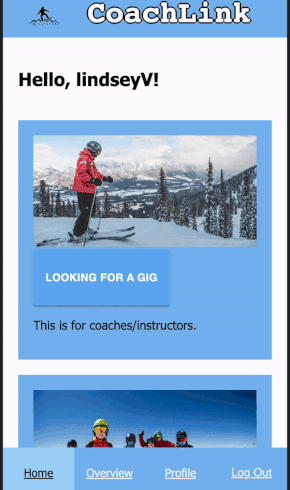

    
    
# CoachLink

## Table of Contents

- [Description](#description)
- [Screenshots](#screenshots)
- [Built With](#built-with)
- [Getting Started](#getting-started)
  - [Prerequisites](#prerequisites)
  - [Installation](#installation)
- [Usage](#usage)
- [License](#license)
- [Acknowledgements](#acknowledgements)
- [Contacts](#contacts)

## Description

CoachLink is an application that connects ski and snowboard instructors with opportunities to teach at different clubs. Any user can create a gig (teaching opportunity) which is then hosted on the application, and any user can apply to a gig by browsing through possible opportunities. 

The ski and snowboard community is fairly spread-out, so discoverability of teaching opportunities is what this app aims to provide. Additionally this app addresses the goal of reducing barriers to beginners from all backgrounds so more people can access the ski and snowboard community with expert instruction from passionate professionals already part of the community. 

## Screenshots

## Demo

## Built With

## Getting Started

After cloning this Github repository to your computer, run npm install for all necessary dependencies. 

### Prerequisites

You will need all required dependencies listed in the json.package file; to do this, run npm install command in your terminal. 

### Installation
1-Fork the repository

2-Copy the SSH key in your new repository

3-In your terminal type... `git clone {paste SSH link}`

4-Navigate into the repository's folder in your terminal

5-Open VS Code (or editor of your choice) and open the folder

6-In the terminal of VS Code run  `npm install`  and `npm install @mui/material @emotion/react @emotion/styled` to install all dependencies

7-Create a `.env` file at the root of the project and paste this line into the file:
SERVER_SESSION_SECRET=superDuperSecret

8-Create a database named `coach_link` in PostgresSQL If you would like to name your database something else, you will need to change `coach_link` to the name of your new database name in server/modules/pool.js

9-The queries in the database.sql file are set up to create all the necessary tables that you need, as well as a dummy data table to test the app. Copy and paste those queries in the SQL query of the database. If this is going to production, leave out the dummy data.

To run the application locally:

10-Run `npm run server` in your VS Code terminal

11-Open a second terminal and run `npm run client`

## Usage
Once everything is installed and running it should open in your default browser - if not, navigate to http://localhost:3000/
 
Video walkthrough of application usage: https://we.tl/t-iOa0ENdzUY

## License

At this time, there is no license on this project. We created this during our time at Prime Digital Academy as students.

## Acknowledgements

Thank you to Prime Digital Academy for coordinating this opportunity and teaching our team the necessary skills to make this project awesome! Our team is comprised of: Bryce Morries, Max Simmons, Mandi Andrade, Keegan Odell, and Leila Sadr. We also want to thank our friends & families for the emotional support and encouragement throughout this process. Special thanks to Zach Lulavy for trusting us with his vision and sharing his UX/UI expertise and passion for snowboarding with us! We learned so much working with Zach and making CoachLink. 

## Contacts

  
